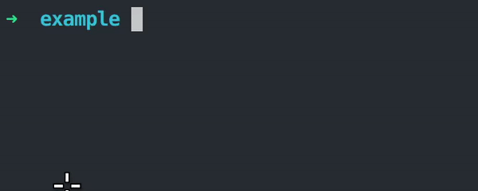

In the [last article](/bash-script-for-token-pasting), we covered the basics of bash scripting for pasting a 2FA token on demand. We'll now take this process a few steps further by adding support for password generation.


## What will we build?

We'll build today a prompt that, when called, will take as input a salt as well as a domain name, and output a unique password that works for you.



## How is it useful?

Consider this:

- You have a weak and meaningful password, that will be quite easy to bypass, but at least you can remember it.

- You have a long and strong password, that might prove harder to guess, but good luck remembering it.

Either way, any password can be hacked and it's always much safer to activate 2FA on your accounts.

Now let's say you go with the second option and have a password with all the recommended criterias. Mixture of upper/lower cases, numbers, symbols, etc... You name it. Truth is, it might end up not as safe as expected, since you'll likely end up forgetting it and saving your password in some sort of safekeep. Maybe a text file, a password manager or some other form of way to have it under your hand when necessary.

You're now at risk of exposing it, rendering the whole "stronger/longer password" process virtually worthless if it leaks.

I was kind of thinking about that a few years ago and came up with another solution: A strong password that can still be remembered. 

The trick is, our brain is much better at keeping patterns in mind than unreadable strings. Instead of trying to recall a sentence, come up with an algorithm that will map an input to a password, given a set of rules that you define.


## Password generation

So how are we generating such password with an algorithm? That's pretty much up to you to decide how to encode your safe code, I'll give an example of one way of doing it. This process will take two inputs: A salt that's unique to you and a domain name, unique to the application you're login in to. You could choose to change that to a username, a special thing about each app, etc. We'll keep things simple for now.

The salt will be composed of 4 numbers that you'll choose. Like a pin, it's the part you'll keep in mind and help making your password safe even if someone find your algorithm.

The domain name will be a lowercase string with max length of 8. It will be responsible of providing a unique password for each website, while still making it easy for you to fetch it in case you forget the password. 

All you have to do is to remember the salt and the process, then you input your domain name and it will give you the unique password. With that in mind, I recommend you to use more than one salt for every app :)

## The algorithm

As I said, we'll keep the algorithm easy since it's only for demo purposes. I encourage you to come up with your own for personal use. 

The process will consist on four steps:

1. Every vowel will be replaced by a given symbol:

```python
vowels = {
    'a' : '!',
    'e' : '@',
    'i' : '#',
    'o' : '$',
    'u' : '%'
}
```

I simply sorted the vowels alphabetically and mapped each one to the symbols in the US keymap, in order.

2. Every recurring consonnant up to five times will be replaced by a given symbol:

```python
recurring = {
    2 : '^',
    3 : '&',
    4 : '*',
    5 : '(',
}
```

Again, US keymapping from where we stopped at the first step.

3. We'll put a figure of the salt every three characters, and append the remaining ones at the end.

4. Finally, every first character after a second number will be upper-cased, the rest will be lower-cased.


```python
from collections import defaultdict 

# Your hashmaps here
[...]

def hash_word(input_word, salt_part):
    generated_word = ""
    appearance = defaultdict(int)
    figure = 0
    next_upper = 0

    for idx, c in enumerate(input_word.lower()):
        if idx % 3 == 0:
            generated_word += salt_part[figure]
            figure += 1
            next_upper += 1

        appearance[c] += 1

        if c in vowels:
            generated_word += vowels[c]
            continue
        
        if appearance[c] > 1 and appearance[c] < 6:
            generated_word += recurring[appearance[c]]
            continue
        
        if next_upper == 2:
            generated_word += c.upper()
            next_upper = 0
            continue

        generated_word += c
    
    if figure < len(salt_part):
        generated_word += salt_part[figure :]

    return generated_word
```


All that's left is to call the function with the right input and the password is yours.

```python

if __name__ == "__main__":
    service = input("Service\n")
    salt = input("Salt\n")

    password = hash_word(service[:8], salt[:4])

    print(password)
```

Result:


## Next steps

Feel free to adapt that example to your liking and use it for personal use. Tune it your way the best way you think, as long as you can remember it :)

The next step in this little adventure will be to make a small desktop app that triggers on a certain key combo to fetch the password on demand.