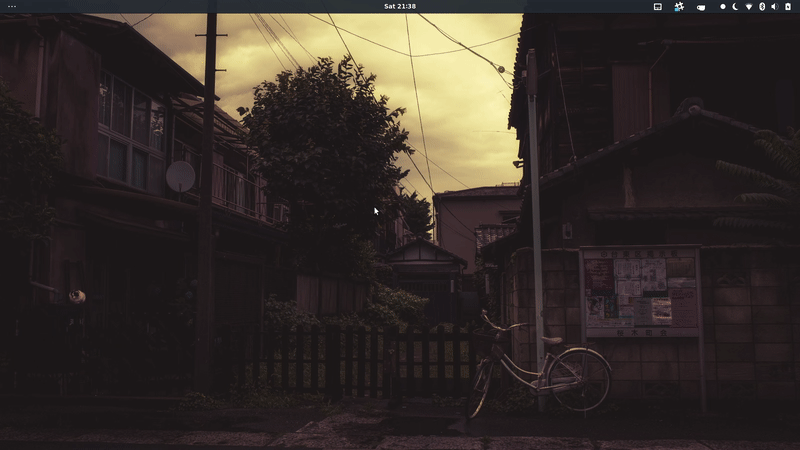
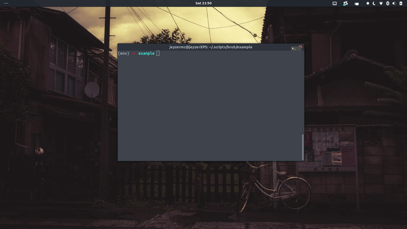
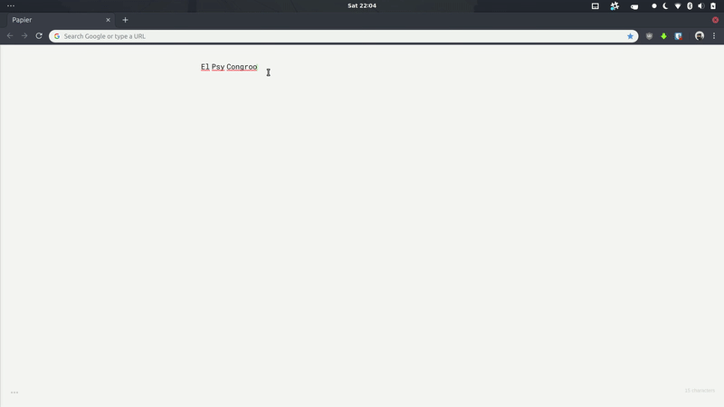

In [the previous article](https.jeyzermc.com), we made a small python script to generate a custom password with a given algorithm.

The problem is, having to manually `cd` into the script directory, run it and copy the output can be painful. Running the algorithm in your head or a piece of paper would be even more troublesome, although it is a good fallback scenario and one of the main strength of this approach: You don't have to remember the password, just the salt and the algorithm. The brain is better at recalling patterns than unreadable strings anyway.

## The solution

The idea here is that we need a small application, accessible anywhere in your device, that will take your salt and domain name as input and paste the password in the correct field for you, while keeping the previous status of your clipboard. After all, hoarding your password in your clipboard could be dangerous: Imagine you paste it in a chatbox later on!

The app we'll build will look somehow like this:




## UI

For the UI, let's keep things simple: We'll use a library called [zenipy](https://github.com/poulp/zenipy), a gtk-based dialog generator for python.

First, let's install it:

```shell
pip install zenipy
```

I personally prefer keeping things contained withing virtual environnements, so I'll install it as follow:

```shell
python -m venv env
source env/bin/activate
pip install zenipy
```

You'll also need `python3-gi`:

```shell
pip install python3-gi
```

Then, let's import zenipy at the top of our script. Since we're dealing with password, we'll use the password module instead of the regular text input.


```python
from zenipy import password
```

Now, replace the `input()` with zenipy's `password()` method to prompt the password field to the user (a.k.a yours truly).

```python
service = password("Service")
salt = password("Salt")
```

Run that, you get:



## Prompt from anywhere

The last step would be to make a shell script to run that python script, get the output, put it into the clipboard, paste the later in the password field and finally, restore the previous state of the clipboard.

All of it could technically be done within our little python script with a library called [pyperclip](https://pypi.org/project/pyperclip/), but I'm experienting issues related to the latest version of Ubuntu with this library. 

I'll cover both the python approach and the shell one.

## Python way

Install pyperclip

```shell
pip install pyperclip
```

Then add the following code at the end of our PassGen script:

```python
    old_clip = pyperclip.paste()

    pyperclip.copy(password)

    pyperclip.paste()

    pyperclip.copy(old_clip)
```

We save the previous state of the clipboard, copy the generated password, paste it and restore the old content of the clipboard.

## Shell way

Using shell, we can achieve the same result just as easily with xclip and xdotool, covered in [a previous tutorial](https://www.jeyzermc.com/bash-script-for-token-pasting):

```shell
oldclip=`xclip -sel c -o`
temp=`/path/to/python /path/to/example.py`
echo $temp | xclip -sel c
sleep 0.5
xdotool key ctrl+shift+v
echo $oldclip | xclip -sel c 
``

This code saves the previous clipboard state, run the PassGen script and paste the result where our cursor is. Then it restores the CTRL+C CTRL+V machine to its old glory, saving us the troubles of pasting passwords where undesired :)

Now make this script runnable and you\'re ready to rock!

```shell
chmod +x example.sh
```


## Accessing the script

Follow the guide at the end of the [Bash Script for Token Pasting](https://www.jeyzermc.com/bash-script-for-token-pasting) tutorial to assign a keyboard shortcut to your script, and you'll be rocking this:




## End words

This concludes our little password generation adventure. We covered how to run a python script on demand from a custom keyboard shortcut, how to make a password generation script and how to make a small GUI to access it from anywhere, anytime you need it on your machine.

I hope you enjoyed it, feel free to share your mind in the comment section below!